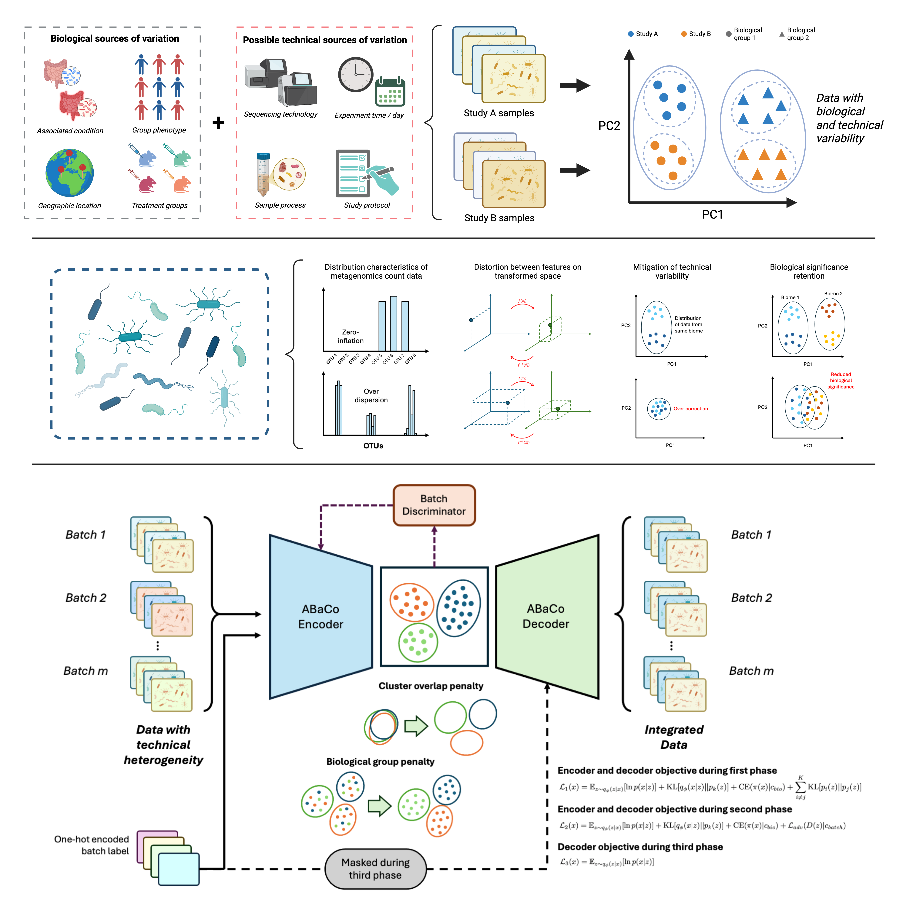

# ABaCo


<h1 align="center">ABaCo</h1>
<p align="center"><em>Batch Effect Correction framework for metagenomic data</em></p>

<p align="center">
    <a href="https://pypi.org/project/abaco/">
        
    </a>
    <a href="https://github.com/Multiomics-Analytics-Group/abaco/actions/workflows/cicd.yml">
        
    </a>
    <a href="https://abaco.readthedocs.io/en/latest/?badge=latest">
        
    </a>
    
    <br>
    <br>
    
    
    
    
</p>


## Table of Contents

- [Installation](#installation)
- [Features](#features)
- [Usage](#usage)
- [Documentation](#documentation)
- [Contributing](#contributing)
- [License](#license)

## Installation 
## Features
## Usage
## Documentation
Tutorials and documentation are available on [Read the Docs](https://abaco.readthedocs.io/)
## Contributing
1. Fork the repository
2. Clone the repository
3. Create a virtual env e.g.
  ```bash
  # navigate terminal to repo
  cd <path-to-repo-root>

  # create virtual env
  python -m venv .venv

  # activate venv
  source .venv/bin/activate
  ```
4. Install abaco in editing mode into the virtual env
  ```bash
  pip install -e .
  ```
5. Make changes
  > Note: we aimt o use numpy style python docstrings [sphinx example](https://www.sphinx-doc.org/en/master/usage/extensions/example_numpy.html#example-numpy)
6. Make a pull request
## License
